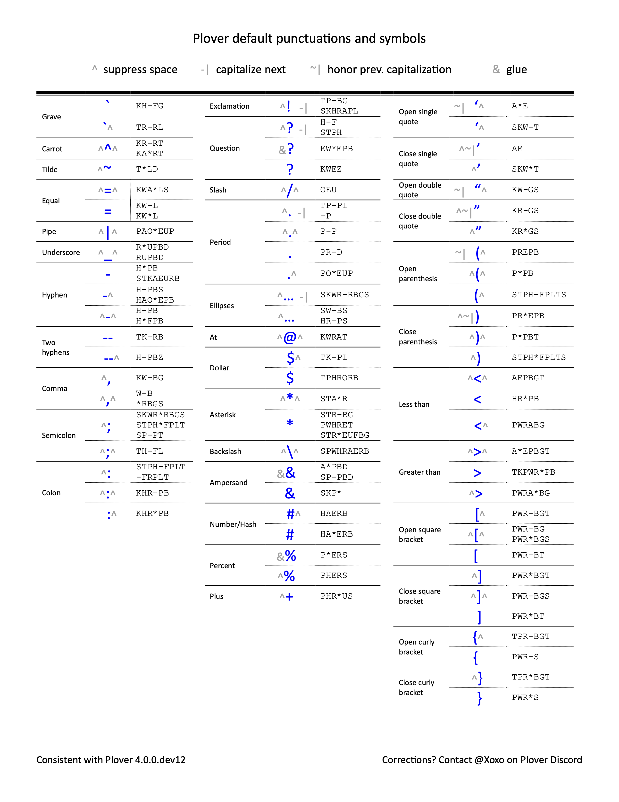

# plover-default-symbols-punctuations
Plover has many symbols and punctuations defined by default in `main.json`. While they are defined at the Plover [non-letter page,](https://www.openstenoproject.org/learn-plover/lesson-7-non-letters.html) it is not organized well and is incomplete. This GitHub repo has **visual aides** that communicate the various default Plover strokes for symbols and punctuations. Color vs non-color and pdf vs png are available.

## Download the visual aides here

| | PDF | PNG |
|-|-------|-------------|
|Color| [Color PDF](symbols_color.pdf) | [Color PNG](symbols_color.png) |
|Black and white| [BW PDF](symbols_BW.pdf) | [BW PNG](symbols_BW.png) |

You may also find the [DOCX source here.](source/symbols.docx)

## Previews

